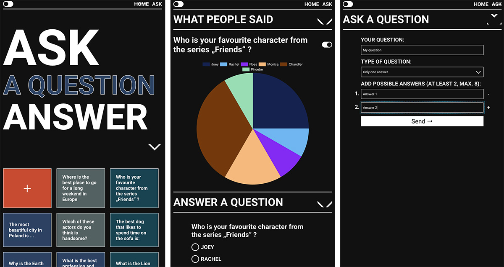
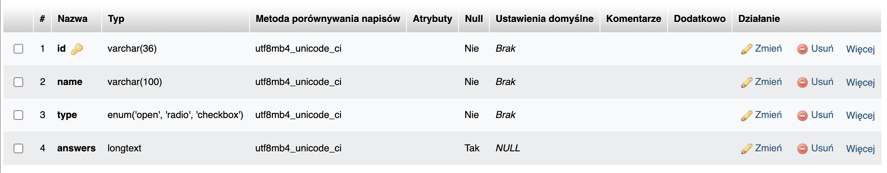

# AskPeopleApp - Backend


## Demo

Working live demo: https://demoproject123.networkmanager.pl/

AI can answer many questions, but not those, realted to likes and judgments.
**AskPeopleApp** displays questions asked by users (on its main view). After clicking on a given question, you can see
how other users answered it (what are presented in the charts / slide with answers) and add your opinion / vote. You can
also create your own question for others to answer. There are three types of questions - open and closed (single and
multiple choice), in which you must also add possible answers.

## General info
This project is server side application that is used to conduct simple surveys among people and present their results in the form of charts / slides.

Frontend repository - https://github.com/golasowska/AskPeopleAppFront

The main goal of the project was to practice creating full-stack applications using React, Node + Express using a MySQL database.

## Tech Stack

- typescript 4.9.5
- express 4.18.2
- mysql2 3.1.2"

## Run project

To develop this project clone repository and run commands:

```bash
  npm run i
```
```bash
  npm run start:dev
```
Remember to recreate MySQL database. 
Database has only one table `'questions'`with fields:



Create also **config/config.ts** file with data from your db.


## Related

[Frontend](https://github.com/golasowska/AskPeopleAppFront)

## Author

- [@golasowska](https://github.com/golasowska)


